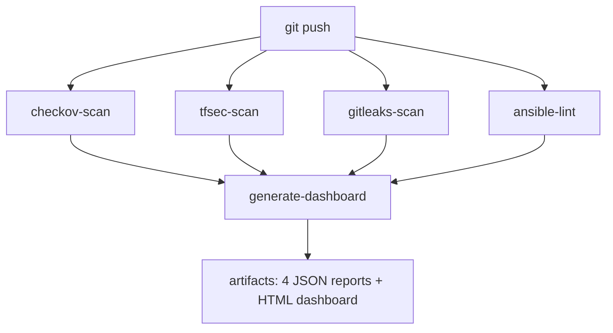

# DevSecOps Pipeline — Shift-Left Static Code Analysis

A GitHub Actions security pipeline that automatically scans Infrastructure as Code (Terraform) and configuration management code (Ansible) on every push — catching misconfigurations, leaked credentials, and bad practices at the cheapest point in the development cycle.

**Student:** Helmi Mastouri ([F0CUSMSK](https://github.com/F0CUSMSK))
**Institution:** EPI Digital School — Sousse, Tunisia · Cybersecurity Engineering (Bac+5)
**Repository:** [github.com/F0CUSMSK/devsecops-pipeline](https://github.com/F0CUSMSK/devsecops-pipeline)

---

## The Security Story

This project demonstrates the complete **Shift-Left cycle**:

| | `vulnerable` branch | `secure` branch |
|---|---|---|
| **Checkov** | 191 findings | **0** |
| **Tfsec** | 91 findings | **0** |
| **Gitleaks** | 3 secrets | **0** |
| **Ansible-Lint** | 29 findings | **0** |
| **Pipeline** | ❌ FAILS — code is blocked | ✅ PASSES — safe to merge |
| **Dashboard** | 314 total findings | **0 total findings** |

The `vulnerable` branch contains intentionally insecure Azure infrastructure (SSH open to the internet, hardcoded passwords, unencrypted storage, no private endpoints…). Every push triggers all four scanners, the build fails, and an HTML dashboard artifact documents every finding. The `secure` branch contains the fully remediated code — same pipeline, zero findings, green build.

> 📸 *Screenshots: red pipeline + 314-finding dashboard (vulnerable) vs. green run #12 + 0-finding dashboard (secure).*

## Pipeline Architecture

The workflow (`.github/workflows/pipeline.yml`) runs five jobs on every push to `main`, `vulnerable`, or `secure`, and on pull requests to `main`:



Each scanner job **fails the build** when it finds something, but only after saving its JSON report. The dashboard job always runs, downloads all four reports, and generates a dark-themed HTML security dashboard as a downloadable artifact.

## The Four Scanners

| Scanner | What it catches | Where | Report artifact |
|---|---|---|---|
| **Checkov** (latest, via official action) | Terraform / Azure misconfigurations — public network access, missing encryption, weak replication, no private endpoints | `terraform/` | `checkov-report` |
| **Tfsec** (v1.28.14) | Deep Terraform security analysis — NSG rules open to the internet, SSH exposure | `terraform/` | `tfsec-report` |
| **Gitleaks** (v8.24.3) | Hardcoded secrets — passwords, API keys — across the **full git history** (`fetch-depth: 0`) | whole repo history | `gitleaks-report` |
| **Ansible-Lint** (latest) | Playbook best practices — module misuse, unsafe file permissions, non-canonical module names | `ansible/` | `ansible-lint-report` |

A fifth artifact — `security-dashboard` — combines all reports into a single HTML page with severity cards, per-scanner status, and detailed findings tables (generated by `.github/scripts/generate_dashboard.py`).

## Key Remediations (vulnerable → secure)

All 13 Checkov failures, 2 Tfsec criticals, 3 historical secrets, and every Ansible-Lint violation were fixed at the source — **no scanner rules were skipped or excluded**. Highlights:

- **Storage account**: geo-redundant replication (GRS), customer-managed encryption key, blob soft-delete, 1-day SAS expiry, shared-key auth disabled, public access disabled
- **Network**: public IP removed from the VM NIC (private-only access via Bastion/VPN), SSH restricted to a private CIDR, NSG attached to the subnet, private endpoint for blob storage
- **VM**: password auth disabled (SSH keys), disk encryption set, extension operations blocked
- **Secrets**: hardcoded values replaced by environment lookups; the three secrets that live in immutable git history are pinned in `.gitleaksignore` (new secrets are still detected)
- **Ansible**: canonical module names (`ansible.mysql.*`, `ansible.builtin.*`), truthy values, idempotent `service_facts` instead of raw `systemctl`

Full details, code listings, and the verification matrix: [`SECURITY_REMEDIATION_REPORT.pdf`](SECURITY_REMEDIATION_REPORT.pdf).

## Run the Pipeline

Nothing to set up — push to any watched branch and GitHub Actions does the rest:

```bash
git push origin secure        # → green run, 0 findings
git push origin vulnerable    # → red run, findings + dashboard artifact
```

Download the **security-dashboard** artifact from any run to view the HTML report.

## Scan Locally with Docker

All four scanners, pre-installed and pinned to the same versions as CI — no local installation needed:

```bash
# build once
docker build -t helmi-devsecops-scanner .

# scan any directory containing Terraform / Ansible code
docker run --rm -v "$(pwd):/code" helmi-devsecops-scanner

# exit code 0 = clean, 1 = findings (CI-friendly)
```

The container auto-detects `terraform/` and `ansible/` subdirectories, scans the full git history with Gitleaks when a `.git` folder is present, and prints a per-scanner summary.

## Repository Structure

```
├── .github/
│   ├── workflows/pipeline.yml          # the 5-job security pipeline
│   └── scripts/
│       ├── generate_dashboard.py       # JSON reports → HTML dashboard
│       └── dashboard/                  # dashboard assets
├── terraform/
│   ├── main.tf                         # Azure RG, VNet, NSG, VM, storage (secured)
│   ├── variables.tf                    # inputs (SSH key, key vault id are sensitive)
│   └── outputs.tf
├── ansible/
│   ├── playbook.yml                    # nginx + MySQL playbook (lint-clean)
│   └── inventory.ini
├── Dockerfile                          # local scanning container
├── docker-entrypoint.sh                # runs all 4 scanners on /code
├── .gitleaksignore                     # pinned fingerprints of historical secrets
├── SECURITY_REMEDIATION_REPORT.pdf     # full remediation documentation
└── README.md
```

## Weekly Breakdown

| Week | Deliverable | Status |
|---|---|---|
| **1** | Vulnerable infrastructure setup — 14 planted flaws, pipeline skeleton, scanners detect them | ✅ DONE |
| **2** | Automated scanning — all 4 scanners correctly failing the build; TerraGoat integration (314 findings) | ✅ DONE |
| **3** | Report generation — JSON reports per scanner + HTML security dashboard artifact | ✅ DONE |
| **4** | Remediation (secure branch, 0 findings) + Docker container + documentation | ✅ DONE |

## Lessons Learned

- **Shift-left works** — every one of the 14 planted flaws was caught automatically before any deployment
- **Scanners need tuning too** — a buggy action (`tfsec-action`), a swallowed exit code (`continue-on-error`), or a shallow clone (`--log-opts=-1`) can silently disable a scanner
- **Deleting a leaked secret is not enough** — git history keeps it forever; detect with full-history scans, remediate with fingerprint-based ignores + credential rotation
- **Fix the code, not the scanner** — every finding was remediated at the source; no rules were skipped or excluded

---

*Helmi Mastouri · EPI Digital School · Cybersecurity Engineering 2026*
